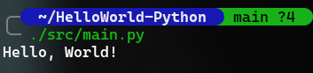

# HelloWorld-Python


[简体中文](README.zh-Hans.md) | [繁體中文](README.zh-Hant.md) | English

A simple Hello World program written in Python.

## Preview

| Linux | macOS | Windows |
|:-----:|:-----:|:-------:|
|  |  |  |

## Features

- Pure standard library implementation, no third-party dependencies required
- Cross-platform compatible (Linux / macOS / Windows)
- Clean and concise code, ideal for Python beginners
- Compatible with Python 2.6+

## Requirements

| Dependency | Version |
|------------|---------|
| Python | >= 2.6 |
| Third-party libraries | None |

Check your Python version:

```bash
python --version
# or
python3 --version
```

## Quick Start

### 1. Clone the repository

```bash
git clone https://github.com/WinTerminal/HelloWorld-Python.git
cd HelloWorld-Python
```

### 2. Run the program

```bash
python src/main.py
```

### 3. View the output

```
Hello, World!
```

## Project Structure

```
HelloWorld-Python/
├── src/
│   └── main.py              # Entry point
├── docs/
│   ├── getting-started.md   # Getting started guide
│   ├── architecture.md      # Architecture documentation
│   ├── api.md               # API reference
│   ├── faq.md               # Frequently asked questions
│   └── troubleshooting.md   # Troubleshooting guide
├── readme/
│   └── README.md            # Detailed project documentation
├── preview-linux.png        # Linux preview screenshot
├── preview-macos.png        # macOS preview screenshot
├── preview-windows.png      # Windows preview screenshot
├── requirements.txt         # Dependencies (none)
├── LICENSE                  # MIT License
└── .gitignore               # Git ignore rules
```

## Source Code

`src/main.py` is the only source file:

```python
#!/usr/bin/env python
print('Hello, ' + "World!")
```

- `#!/usr/bin/env python` — Shebang line, specifies the system default Python interpreter
- `print('Hello, ' + "World!")` — Outputs `Hello, World!` using string concatenation

## FAQ

### Does it work with Python 2?

Yes. `print('Hello, ' + "World!")` works in Python 2.6+ — the parentheses serve as expression grouping, not a function call.

### `No such file or directory` error

Make sure you are in the project root directory and run `python src/main.py`, not `python main.py`.

## Documentation

| Document | Description |
|----------|-------------|
| [Getting Started](docs/en-US/getting-started.md) | Run the project from scratch |
| [Architecture](docs/en-US/architecture.md) | System architecture and data flow |
| [API Reference](docs/en-US/api.md) | Functions and operations |
| [FAQ](docs/en-US/faq.md) | Frequently asked questions |
| [Troubleshooting](docs/en-US/troubleshooting.md) | Error reference and diagnostics |

## Fun Facts

- `main.py` is **2 lines**. Documentation across all languages totals **1659 lines** — that's **829.5x** more text than code.

| File | Lines |
|------|------:|
| `README.md` | 125 |
| `README.zh-Hans.md` | 125 |
| `README.zh-Hant.md` | 125 |

## License

This project is licensed under the MIT License — see [LICENSE](LICENSE) for details.
